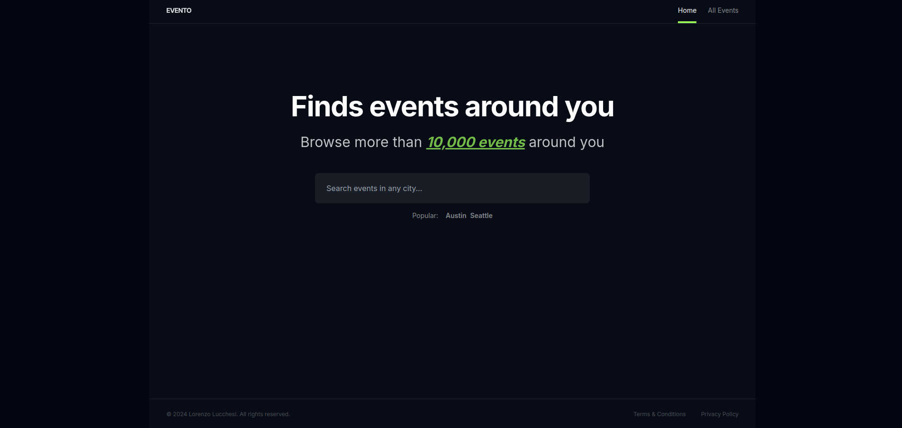
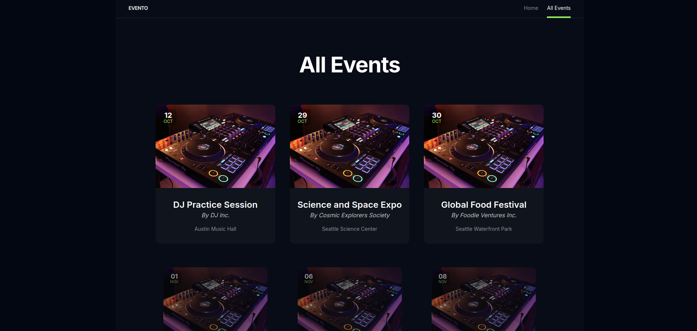
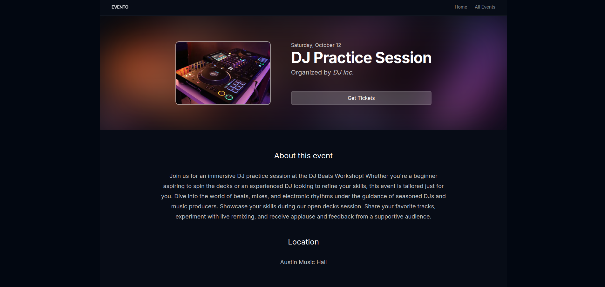

# Evento

Evento is a web application that allows you to search and view events in different cities.

## Features

- Search for events by city.
- View event details such as date, time, and location.
- Intuitive and user-friendly interface.

## Tech Stack

TypeScript, Next.js, Tailwind CSS, Prisma, Zod, and Framer Motion.

## Screenshots

## Installation

Run the following commands:

1. `npm i`
2. Create a new `.env` file in the root directory and add `DATABASE_URL="file:./dev.db"`
3. `npx prisma db push`
4. `npx prisma db seed`
